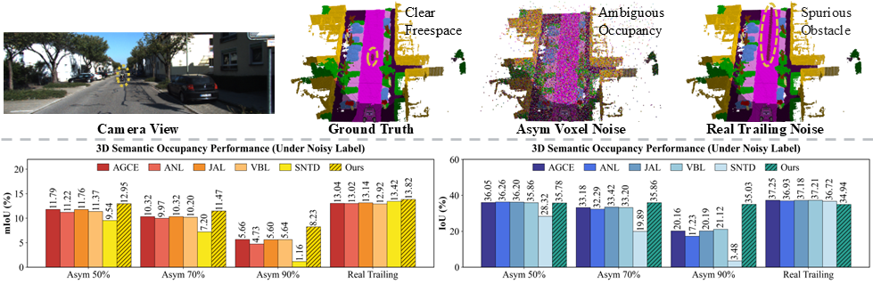

# OccNL
The official implementation of OccNL

## Overview
3D semantic occupancy prediction is a cornerstone of robotic perception, yet real-world voxel annotations are inherently corrupted by structural artifacts and dynamic trailing effects. This raises a critical but underexplored question: can autonomous systems safely rely on such unreliable occupancy supervision? To systematically investigate this issue, we establish OccNL, the first benchmark dedicated to 3D occupancy under occupancy-asymmetric and dynamic trailing noise. Our analysis reveals a fundamental domain gap: state-of-the-art 2D label noise learning strategies collapse catastrophically in sparse 3D voxel spaces, exposing a critical vulnerability in existing paradigms. To address this challenge, we propose DPR-Occ, a principled label noise-robust framework that constructs reliable supervision through dual-source partial label reasoning. By synergizing temporal model memory with representation-level structural affinity, DPR-Occ dynamically expands and prunes candidate label sets to preserve true semantics while suppressing noise propagation. Extensive experiments on SemanticKITTI demonstrate that DPR-Occ prevents geometric and semantic collapse under extreme corruption. Notably, even at 90% label noise, our method achieves significant performance gains (up to 2.57% mIoU and 13.91% IoU) over existing label noise learning baselines adapted to the 3D occupancy prediction task. By bridging label noise learning and 3D perception, OccNL and DPR-Occ provide a reliable foundation for safety-critical robotic perception in dynamic environments. 

## Demo
[Demo video](https://github.com/user-attachments/assets/10275f80-a6f8-42f0-a7d1-1daa0546c08b)

A higher resolution version of the demo video can be found here: 
[Bilibili Link](https://www.bilibili.com/video/BV1zNNMzSEyS/)

